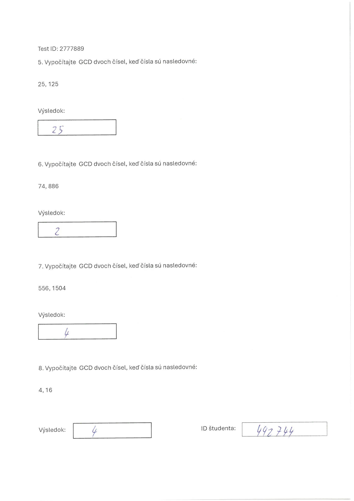
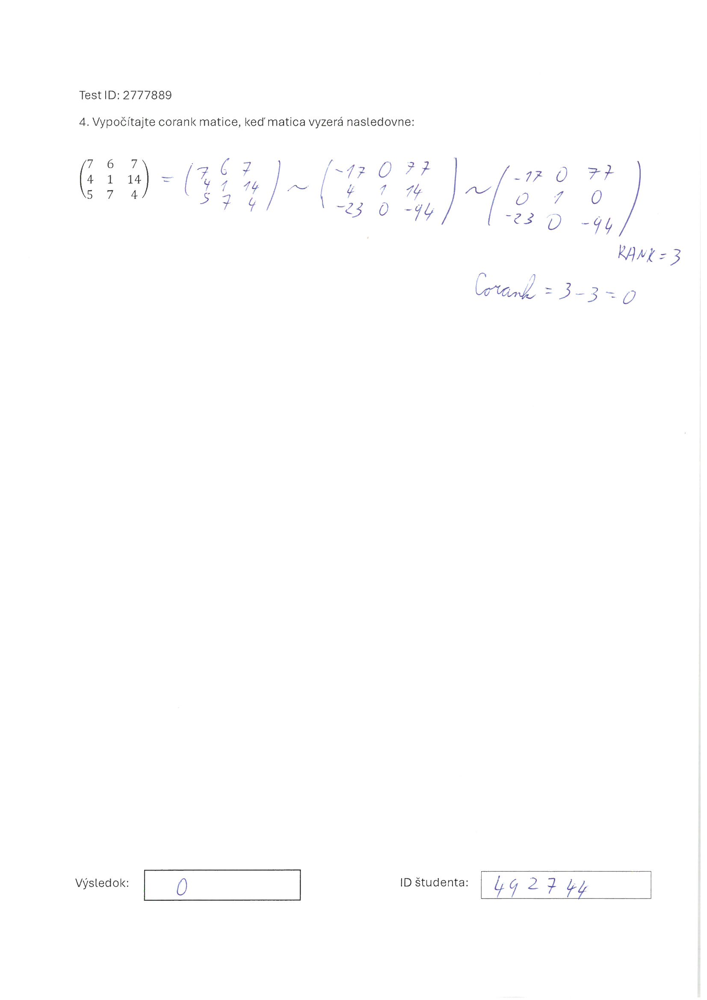

# Thesis Project

**Author:** Bc. Boglárka Farkas  
**Supervisor:** Ing. Eugen Antal, PhD.

## Overview

As part of this thesis, a Dockerized web application was developed. The purpose of this application is to assist teachers in correcting math exams more efficiently.

The platform allows users (typically teachers) to save the correct results of individual math problems. This makes later it easier to evaluate exams what students solved. The user has the possibility to evaluate individual test tasks, which are mathematical problems, through the website.

To use the system, the user must upload an image of the student's solution. The system then compares the extracted result with the correct answer stored in the database.

The application is limited to mathematical problems whose solutions are either positive or negative integers.

## How to use

If you want to try it out, you must have Docker Desktop installed on your device. First, open Docker Desktop. Then, navigate to the `math_check` folder using the command line, and run the following command:

`docker compose up --build`

Once everything is ready, you can open the following link in your browser: [http://localhost:3000/](http://localhost:3000/)

## Input Format Example

To ensure correct evaluation, the structure of the exams must follow a specific format. Below are some examples of how an exam should look:

